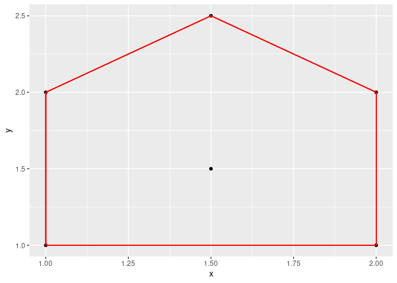
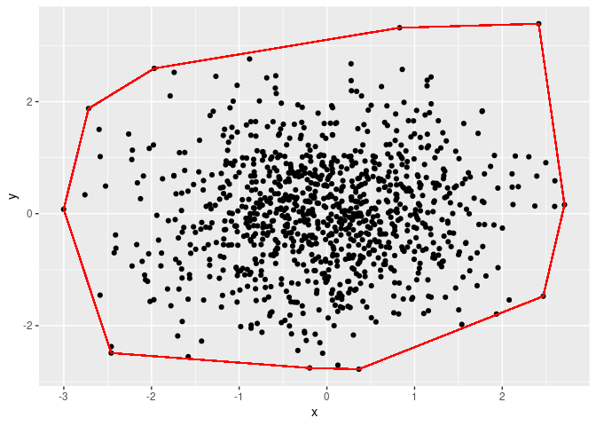

<!-- README.md is generated from README.Rmd. Please edit that file -->

# jarvismarch

<!-- badges: start -->
<!-- badges: end -->

The goal of jarvismarch is to provide the means to find and plot the
convex hull of a set of points in 2D space.

## Installation

You can install the development version of jarvismarch like so:

``` r
library(devtools)
install_github("lmaxhowell/jarvismarch")
```

## Example

This is a basic example of the main function:

``` r
library(jarvismarch)
Points <- list(c(1,1),c(2,1),c(1,2),c(2,2),c(1.5,1.5),c(1.5,2.5))
jarvis_march(Points, plot=TRUE)
```



    #>    x1  y1  x2  y2
    #> 1 1.0 1.0 2.0 1.0
    #> 2 2.0 1.0 2.0 2.0
    #> 3 2.0 2.0 1.5 2.5
    #> 4 1.5 2.5 1.0 2.0

The call plot=TRUE only prints the plot, it does not return the ggplot
object. For that use the function jarvis_march_plot()

``` r
g <- jarvis_march_plot(Points)
```


There is also the function in_hull which tests if a point is in the
convex hull or not. For example;

``` r
in_hull(Points, list(c(1,1),c(1.5,1.5)))
#> [1]  TRUE FALSE
```

Which returns True for the first point, as it is in the hull, and false
for the second point, as it it not in the hull.

The function jarvis march can take as inputs a list of vectors like
above, a dataframe of x and y coordinates or a single numeric vector
alternating x and y coordinates.

``` r
Points2 <-  data.frame(x=c(1,2,1,2,1.5,1.5),y=c(1,1,2,2,1.5,2.5))
Points3 <- c(1,1,2,1,1,2,2,2,1.5,1.5,1.5,2.5)
```

Will all work and produce the same output as the example earlier.

A more heavy duty example of the function:

``` r
set.seed(1313)
df <- data.frame(x=rnorm(1000),y=rnorm(1000))
jarvis_march(df)
#>           x1          y1         x2        y2
#> 1 -3.0015525  0.07835094 -2.4594542 -2.487760
#> 2 -2.4594542 -2.48776047 -0.1954551 -2.755280
#> 3 -0.1954551 -2.75527968  0.3648441 -2.776838
#> 4  0.3648441 -2.77683831  2.4669760 -1.474127
#> 5  2.4669760 -1.47412673  2.7093968  0.159622
#> 6  2.7093968  0.15962195  2.4157360  3.390681
#> 7  2.4157360  3.39068148  0.8294667  3.319490
#> 8  0.8294667  3.31949016 -1.9688820  2.593454
#> 9 -1.9688820  2.59345362 -2.7173647  1.877221
g2 <- jarvis_march_plot(df)
```



## The Jarvis March Algorithm

The Jarvis March or ‘gift wrapping’ algorithm is designed to find the
subset of points within a set such that, when connected with straight
lines, the subset fully encases every point in the set. It does this by
finding a subset such that for any two successive points in the subset,
every other point in the set is anticlockwise to them. Pseudocode can be
found below. \### Pseudocode $S \subset \mathbb{R}^2$ is a set of points
with $|S|>3$. Let $p,q,i \in S$. The aim of this algorithm is to find a
subset of points that, when joined with straight lines, fully contain
every point in $S$.

1)  Initalise empty convex hull, initalise $p$ as the left most point in
    the set, and intitalise $q=0$.
2)  Begin WHILE
    1)  Add $p$ to the convex hull
    2)  Set $q$ as the next point in the set. If $p$ is at the end of
        the set, wrap around to the beginning ($q = (p+1) \mod |S|$).
    3)  Begin FOR each point $i$ in $S$
        1)  If the triple $p,i,q$ is anticlockwise, set that point $i$
            to be the new $q$.
    4)  End FOR.
    5)  Set $p=q$.
    6)  If this $p$ is the same as the first point in the convex hull,
        end WHILE.
